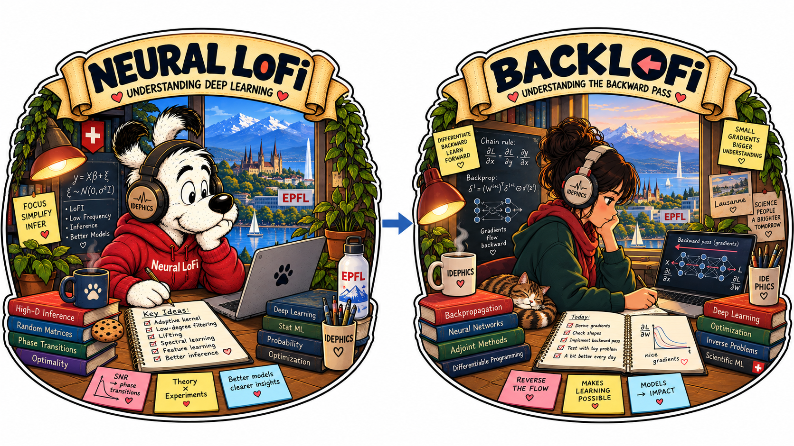
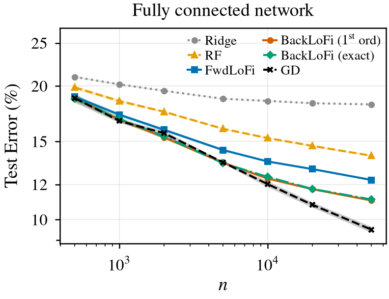
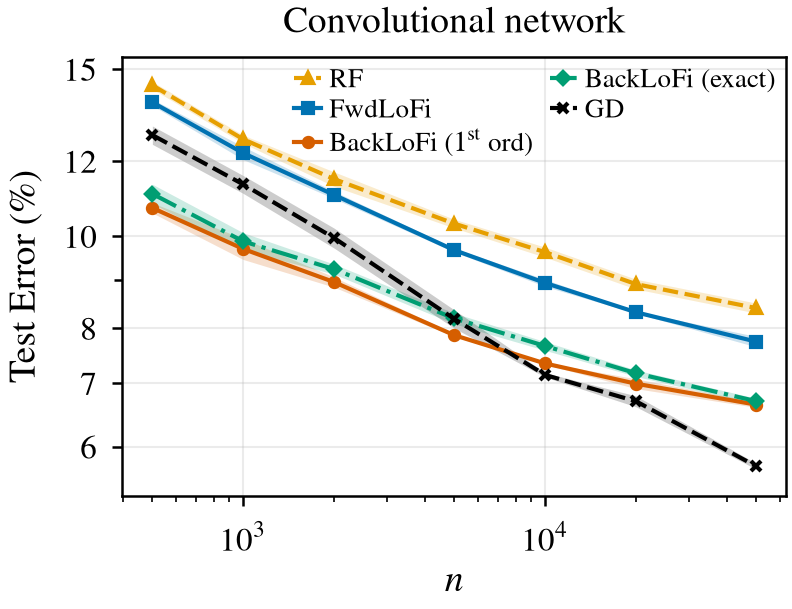

# Neural LoFi with Backward Coupling


<p align="center">
  
</p>


Code for the paper *Neural LoFi with Backward Coupling: A Spectral Theory of
Cross-Layer Feature Learning* (IdePHICS laboratory, EPFL).

It contains the `neural_lofi` package — layer-wise spectral training with random features,
label-aware eigenreduction and a ridge readout — the row-then-column backward
correction of Algorithm 2 (fully connected and convolutional networks,
fixed-width swap and damped dense update), the full-batch gradient-descent
baselines on the same architectures, the scripts that generate every real-data
figure of the paper, and the numbers behind those figures so that they can be
redrawn without rerunning anything.

<p align="center">
  
  
</p>

*Test error against the number of training samples on binary CIFAR-10 (animal
vs. vehicle) at matched width: forward Neural LoFi, the backward-coupled
correction with the first-order and the exact signal, the random-features
network, ridge on the pixels, and full-batch gradient descent.*

## Installation

Python >= 3.11 and a recent PyTorch (CUDA for the convolutional experiments and
the gradient-descent baselines; the fully connected spectral experiments run on
CPU).

```bash
python -m venv .venv && source .venv/bin/activate
pip install -e .
```

The dependencies are listed in `pyproject.toml`. `mpi4py` is optional
(multi-node sweeps with `scripts/parallel_run.py`). CIFAR-10 is downloaded by
`torchvision` into `./data` on first use.

## Redrawing the figures

`data/` holds the seed-level test errors of every cell the figures use
(`data/README.md` describes the files). The plotters redraw the figures from
them in seconds:

```bash
python scripts/plotting/plot_paper_test_error_vs_n.py --from-data --out-dir figures
python scripts/plotting/plot_paper_passes_ffn.py      --from-data --out-dir figures
python scripts/plotting/plot_paper_dense_ffn.py       --from-data --out-dir figures
python scripts/plotting/plot_paper_appendix_g.py      --from-data --out-dir figures \
    --gd-cnn-ns 1000 5000 10000 50000
```

Each script prints the selection table behind its figure (best configuration
per `n`, seed mean and standard error). `figures/` contains the output as it
appears in the paper.

## Reproducing the experiments

`REPRODUCE.md` gives, figure by figure, the scripts, configurations, grids
(widths, ranks, passes, training-set sizes, learning rates, seeds) and commands
that produced `data/`. Every experiment script is run from the repository root,
takes a base configuration with `--conf` and `key=value` overrides after
`--override`, and writes one JSON per cell into `results/` (existing cells are
skipped, so interrupted sweeps resume). `scripts/parallel_run.py` runs the
Cartesian product of a sweep YAML over a pool of workers;
`slurm/array_template.run` is a generic SLURM array template. Running a plotter
with `--dump-data` regenerates the files of `data/` from `results/`.

## Layout

```
src/neural_lofi/            the package
  models/spectral.py        SpectralModel: reduce-first blocks (filter V, random expand W, ReLU)
  models/backprop.py        the trainable twin of a block config (GD baselines)
  training/spectral.py      forward Neural LoFi: one covariance/eigen pass per filter
  training/backward_rowcol.py       Algorithm 2 on fully connected networks (fixed-width swap)
  training/backward_rowcol_cnn.py   Algorithm 2 on the convolutional network
  training/backward_rowcol_dense.py damped dense update W <- (1-a) W + a * estimate
  training/eigen/           signed-covariance eigen primitives
  datasets/                 dataset registry (CIFAR-10 with the animal/vehicle preset)
scripts/                    experiment scripts (one JSON per cell, skip-if-exists)
scripts/plotting/           the paper figures (from results/ or from data/)
conf/                       base configurations of the paper's arms; conf/sweeps/ the grids
data/                       seed-level numbers behind every figure
figures/                    the figures of the paper
synthetic/                  the deep-staircase experiment (placeholder, see its README)
REPRODUCE.md                figure-by-figure commands and grids
```

## Synthetic experiment

The deep-staircase experiment of the paper (Gaussian teacher with a visible
and two hidden feature blocks) lives in `synthetic/`; see `synthetic/README.md`.

## Citation

To be added with the arXiv identifier.

## License

MIT, Copyright (c) 2026 IdePHICS. See `LICENSE`.
